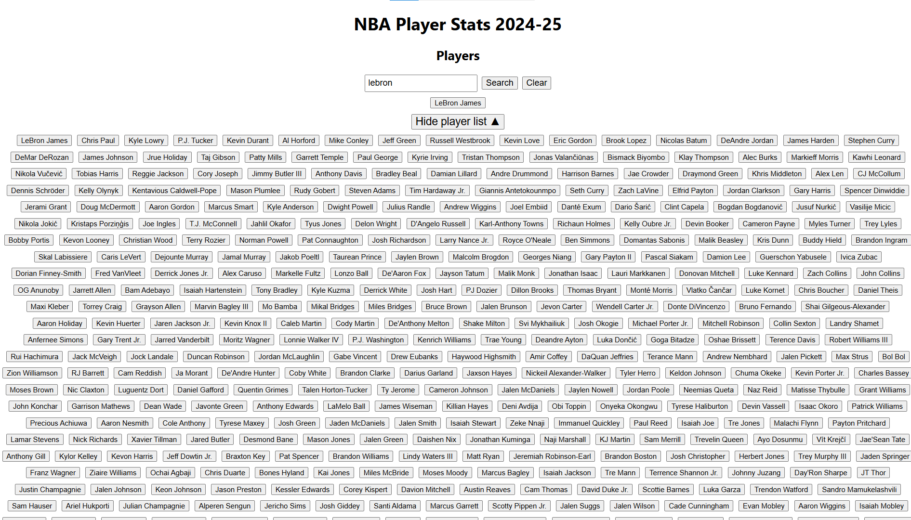
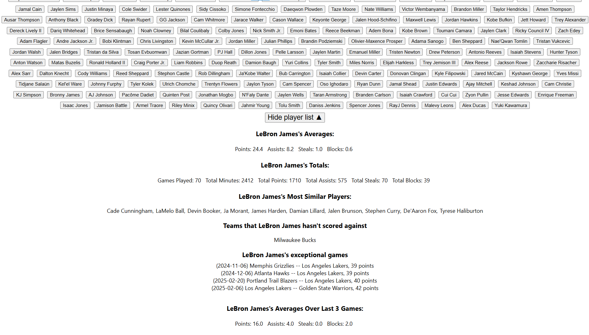
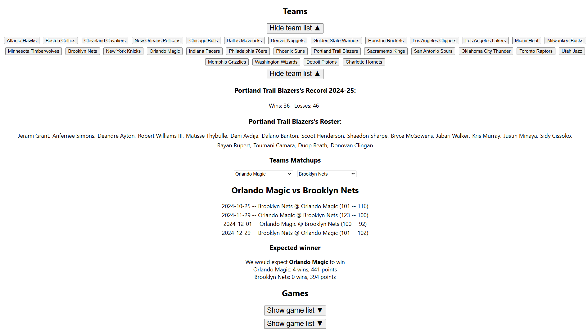
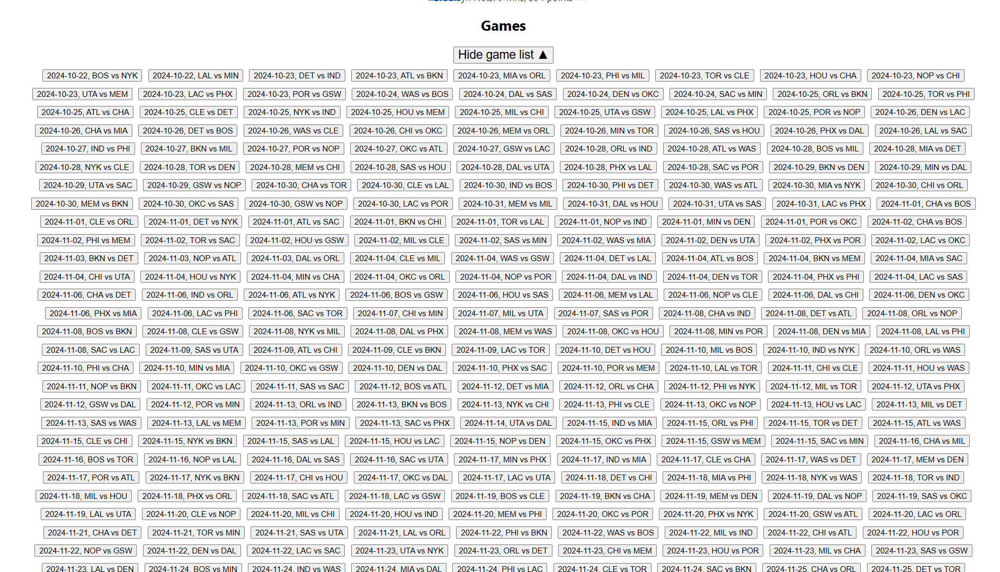
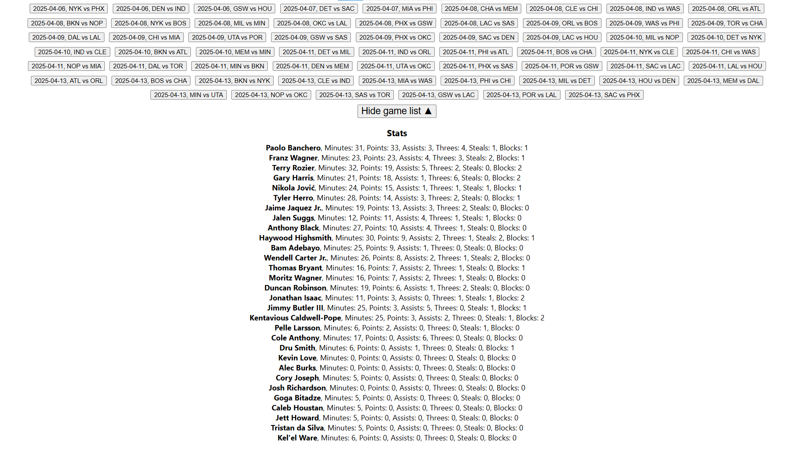

## Setup Instructions

### 1. Clone the Repository
```bash
git clone git@github.com:Eric13531/CS348-Project.git
cd CS348-Project/milestone-0
```

### 2. Start the Backend

```bash
cd backend
python -m venv .cs348env
source .cs348env/bin/activate # Mac/Linux
.cs348env\Scripts\activate # Windows

pip install -r requirements.txt

uvicorn main:app --reload
```

Backend will be running at `http://127.0.0.1:8000`

You should replace the fields in DB_CONFIG to suit your system and connect to local mysql instance

To create the database and load the sample database, simply create your database in mysql,
run `backend/sql/schema.sql` to set up the tables, and `backend/sql/player_insert.sql`, 
`backend/sql/team_insert.sql`, `backend/sql/game_insert.sql`, `backend/sql/team_member_insert.sql`, 
`backend/sql/player_stats_insert.sql`

Currently, our application only supports seeing all the stat averages of the players in our sample database.
We have a sample feature defined in `backend/sql/feature1_sample.sql` which produced the output file 
`backend/sql/feature1_output.csv`, a similar function is coded and accessible through our backend.

You can also see the player_id and player names of all players in our sample database using `http://127.0.0.1:8000/players/`

To create and load the production database, run `backend/sql/production/schema.sql`, then run `backend/database/team_insert.py`, 
`run backend/database/player_insert.py`, `run backend/database/game_insert.py`, `run backend/database/team_member_insert.py`, 
`run backend/database/player_stats_insert.py`

Note: Due to the public API blocking some requests, you must run `python database\player_stats_insert.py 0 100` for all ranges of 100
up to 1300. There is some commented out directions at the bottom of the file which you may paste into your terminal to load all the player stats data.

Because some of our advanced features require additional setup, you should also run `sql/features/advanced/advfeature2.sql`, `sql/features/advanced/advfeature6.sql`

We have implemented all 5 basic features and all 7 advanced features

Running the React app and setting the app URL to `http://127.0.0.1:8000` will run the frontend

Here are the expected results:






Updated screenshots of the new features can be found in the report

### 3. Start the Frontend

```bash
cd ../frontend
npm install

npm start
```

Frontend will be running at: `http://localhost:3000`

### 4. Set up Environment Variables

`frontend/.env`
```ini
REACT_APP_API_URL=http://127.0.0.1:8000
```
